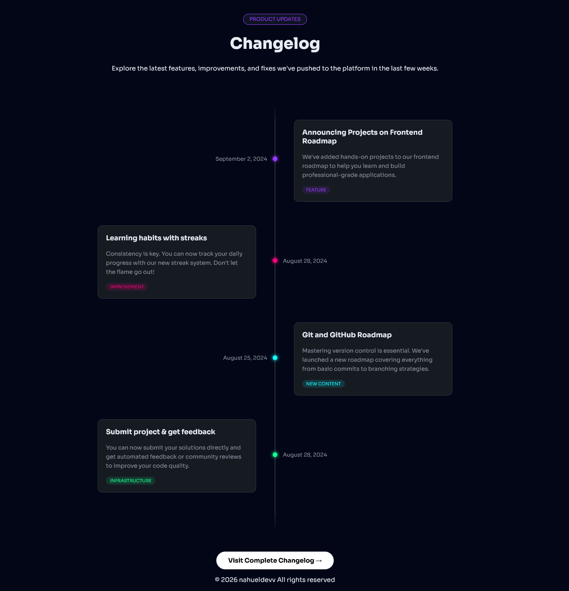

# Changelog Component

## Description
A sleek, timeline-based UI component designed to showcase product updates and feature releases. Built with semantic HTML5 and modern CSS, it features a responsive "zigzag" layout, custom neon aesthetics inspired by the SynthWave '84 theme, and smooth transparency effects using CSS masking for a premium, polished feel. [ref][ref-changelog-component]

[ref-changelog-component]: https://roadmap.sh/projects/changelog-component